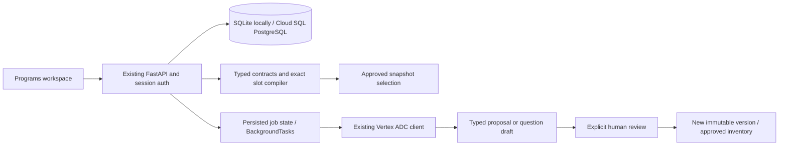
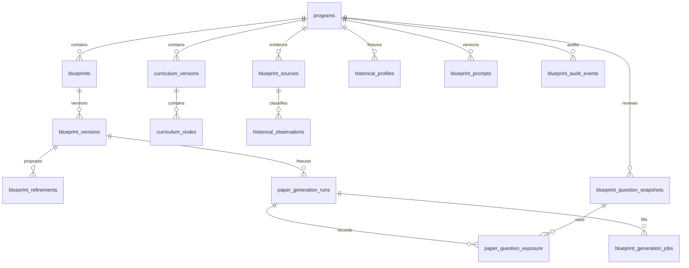

# Generic Programs and Blueprint Engine

This additive feature lives on `codex/feature-generic-blueprint-engine`, based on `develop` commit `3b49975`. It does not replace the existing question ingestion, exams, authentication, or legacy exam-generator routes. No existing question content or IDs are backfilled or rewritten.

## Architecture

FastAPI serves `/api/programs`; the existing vanilla JavaScript admin workspace loads the Programs module. The existing session, role and CSRF helpers authorize requests. The application has no organization model; all new records are program-scoped within the existing installation. Existing ADMIN users perform editing, review and publication. Other authenticated users can read active programs and published blueprint versions.





## Domain and deterministic controls

Three blueprint kinds have separate typed payloads: EXAM_PATTERN, EXAM_GENERATOR and QUESTION_GENERATOR. A fourth artifact, the paper run, freezes exact dependency versions, selected question snapshots, hashes, seed, algorithm version, candidate-pool hash and gap report.

Every blueprint save appends a version. Payloads have no update/delete endpoint. Lifecycle: DRAFT → IN_REVIEW → PUBLISHED → RETIRED. Program DELETE archives and retains history. Stable program codes cannot change; optimistic revisions reject stale program, prompt and blueprint edits. Clone and compare APIs retain original versions. Publishing sample patterns is blocked; official evidence must be registered, included and approved.

Marks use Decimal strings, including negative and partial credit. Validators check section/block totals, presented versus attempted counts, choice-group identity, option/type compatibility, passage sizes, complete section timing, and all five difficulty percentages. Integer allocation uses largest remainder with a stable canonical tie-breaker. Exact selection checks academic approval separately from transcription approval, subject, variant, curriculum, difficulty, language, scoring, option count, solve-time ceiling, cognitive skill, visuals, exposure, question identity, semantic cluster, normalized duplicate stems and complete stimulus groups. Search has an explicit node budget; exhaustion reports an error instead of pretending that the pool is insufficient.

## Local operation

Use the existing environment and virtual environment. From the repository root:

```sh
PYTHONPATH=. .venv/bin/python -m pytest -q
node --check static/programs.js
node --check static/blueprint-forms.js
node --check static/blueprint-workspace.js
node tests/test_ui.cjs
node tests/test_pdf_selection.cjs
```

For isolated UI verification, start a **local-only** server with synthetic users and a separate data directory:

```sh
QB_DATA_DIR=/tmp/meritiqra-programs-validation APP_ENV=development AUTH_MODE=mock ADMIN_EMAILS=admin@example.test APP_BASE_URL=http://127.0.0.1:8044 .venv/bin/uvicorn app:app --host 127.0.0.1 --port 8044
```

Then run `.venv/bin/python tests/validate_programs_ui.py`. Never configure mock authentication in production.

## Migration and deployment considerations

`0008_generic_blueprints` follows `0007_registration_identities`. It only creates new tables and indexes, using the existing SQLite/PostgreSQL DDL adapter. SQLite local initialization also creates these tables idempotently. Cloud deployment uses the existing Alembic entrypoint and `DATABASE_URL`; run `alembic upgrade head` through the established deployment mechanism after normal backup/review. The downgrade deliberately refuses to destroy durable history; roll back application traffic instead.

No new GCP services, secrets, API keys, IAM bindings, buckets or deployment changes are introduced. This branch has not been deployed. Existing Cloud Run process lifecycle still applies: BackgroundTasks are not a durable external queue. Queued/running work is persisted; an admin may retry failed jobs or jobs stalled for ten minutes. A generation job is unique per run/slot. Claim timestamps prevent stale workers from overwriting a retried job. A managed worker queue would require separate deployment design.

## Programs and designers

Open **Admin → Programs**. Add a program, search by code/name, edit metadata, archive or restore. Open its workspace:

- **Patterns:** create an edition and authority, languages, timing and exact scoring; add sections and blocks. Sample patterns must remain sample-only.
- **Exam Blueprints:** reference an exact pattern version and one rule per block. Set language, curriculum node, question blueprint version and all five difficulty percentages.
- **Question Blueprints:** select inheritance scope and exact parent version. Each difficulty stores only explicit overrides. “Effective profiles” displays resolved inherited values. Soft settings include reasoning steps, readability, distractors, solution guidance, language/age guidance and formula/chemistry constraints.
- **Curriculum:** create a draft, add subject/chapter/topic/subtopic/learning-outcome nodes, then freeze by publishing. Parents must belong to that version and be a higher scope.
- **Historical evidence:** register authorized links and SHA-256 values, review source/checksum and inclusion, classify historical questions, approve classifications, and build a frozen profile.
- **Gemini & prompts:** create immutable prompt versions, request refinement and review each proposed old/new field with reason, confidence, evidence and impact.
- **Paper generation:** register manual drafts or exact existing question versions, review academic correctness and source fidelity separately, check feasibility, freeze a run, author missing standalone questions, review new inventory, and create a fresh run.
- **Audit:** inspect actor-attributed lifecycle and review events.

Structured fields are generated from server contracts. Advanced JSON import/export is available for technical administrators. Saving imports still runs all server validations. IDs shown in version history are exact references, not mutable “latest” pointers.

## Evidence and history

Source registration links HTTPS/GCS resources; it does not fetch arbitrary URLs. The reviewer attests that the registered checksum matches the document. Historical observations require an included, approved HISTORICAL_QUESTION_PAPER. Each paper/question reference is unique. Generated-origin classifications are rejected by the contract.

Profiles include counts, recency-weighted counts, sample/source-diversity warnings, algorithm and evidence hashes, and full frozen source/classification metadata. Later source exclusion does not rewrite earlier profiles. Statistics are empirical, never official hard rules. The default recency half-life is five years; the profile records its reference year and half-life.

## Gemini configuration and review

The existing `llm_extract._client()` supplies Vertex AI, ADC, project and region. Set `BLUEPRINT_GEMINI_MODEL` explicitly to an approved model ID. Optional purpose overrides are `BLUEPRINT_BLUEPRINT_REFINEMENT_MODEL`, `BLUEPRINT_QUESTION_AUTHORING_MODEL`, and `BLUEPRINT_INDEPENDENT_SOLVING_MODEL`. Existing project/region configuration remains authoritative. No consumer Gemini key is used.

Calls use structured Pydantic output, disabled function calling, an 8,192-token output limit and the existing 180-second client timeout. Transport timeout/connection failures have at most two attempts. Independent solving uses temperature zero; authoring/refinement uses 0.2. Successful calls retain model, parameters, usage, latency, attempts, prompt version and outcome. Failure records expose safe error categories, not provider stack traces or credentials. Normal tests mock Gemini; no live calls are needed.

Refinement permits a narrow allowlist of soft authoring fields. Exam-pattern hard facts, scope, dependencies, scoring, options and publication cannot be changed by proposals. Unauthorized paths invalidate the proposal even if a reviewer would reject that particular field. Accepted fields create a new DRAFT, with optimistic locking against newer edits. Original versions survive all failures.

Question authoring receives a compiled missing slot and effective difficulty profile. An independent solver receives neither the author's answer nor solution. Schema, options, answer agreement, slot constraints and verifier gates are checked. Both passing and failing authored content remain unapproved drafts, with provenance. Failed independent verification blocks academic approval. Human reviewers must attest source fidelity, answer/solution, curriculum/age/language and duplicates/visuals.

To opt into a live smoke test, configure ADC and the model only in your test environment, create a small sample program and prompt, then request one refinement from the UI. Inspect its state, telemetry and proposal; explicitly accept a soft field and verify the original version hash is unchanged. No live smoke test has been run as part of the offline validation.

The registry supports ten named prompt purposes from extraction through originality validation. Currently the executable Gemini workflows are refinement, question authoring and independent solving. Prompt editing is not model-weight fine-tuning. The admin-only `training-export` endpoint includes only accepted, explicitly training-eligible configuration pairs, with email/phone redaction and without student records or source documents. Review exports for other identifiers before using them externally; no tuning job is launched.

## API map

All paths are under `/api/programs`, using existing auth and CSRF:

| Area | Paths |
|---|---|
| Programs | list/create; `/{pid}` read/update/archive; `/{pid}/restore` |
| Contracts | `/contracts/all` |
| Blueprints | `/{pid}/blueprints`, `/{bid}/versions`, `/clone`, `/compare`, `/effective/{vid}`, `/versions/{vid}/validate`, `/versions/{vid}/transition` |
| Curriculum | `/{pid}/curricula`, `/{vid}/nodes`, `/{vid}/publish` |
| Evidence | `/{pid}/sources`, `/{sid}/review` |
| History | `/{pid}/historical-observations`, `/{oid}/review`, `/{pid}/historical-profiles` |
| Gemini | `/{pid}/prompts`, `/{pid}/refinements`, `/{rid}/accept`, `/{pid}/jobs/{kind}/{jid}/retry` |
| Inventory | `/{pid}/inventory`, `/{qid}/review` |
| Papers | `/{pid}/paper-feasibility`, `/{pid}/paper-runs`, `/{rid}/approve`, `/{rid}/generate-missing`, `/{pid}/generation-jobs` |
| Audit/export | `/{pid}/audit`, `/{pid}/training-export` |

## Remaining specification gaps

This is a substantial working implementation, **not completion of every item in the supplied production specification**:

- Evidence is linked and manually classified; automated document extraction/classification and source uploads within Programs are not implemented. Existing ingestion still operates separately.
- Automated passage-group and logically exact visual authoring are blocked. Such slots can use reviewed manual/imported groups. There is no new SVG logic validator.
- Mathematical symbolic checks, chemistry balancing, semantic embedding similarity and historical-text leakage detection are not implemented; human review and reported verifier gates must not be described as substitutes for those deterministic checks.
- The ten-purpose prompt registry exceeds the three executable model workflows. Blueprint derivation and automated historical classification are not wired to model jobs.
- There is no automatic legacy taxonomy backfill or ambiguity-report UI; existing records enter through explicit reviewed version mapping.
- Standalone Programs paper snapshots do not automatically become legacy student exams. Publication into the existing exam flow needs a separately validated adapter.
- Version compare/clone are APIs; richer visual comparison and reference pickers are still needed. Effective inheritance currently renders structured values, not a source-by-source matrix.
- No current official Navodaya rules are seeded. Tests use clearly labeled synthetic fixtures.
- PostgreSQL migration/runtime and live Gemini delivery must be checked in an authorized environment before production release. No APK build, push, merge or deployment is included in this feature work.
